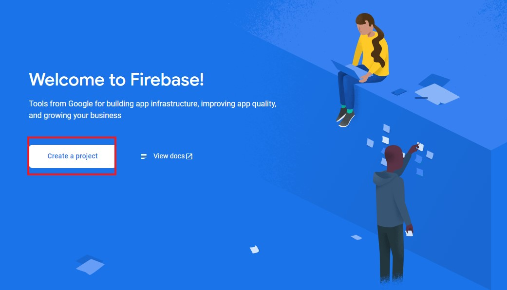
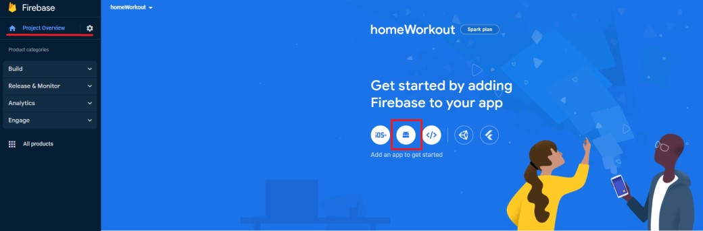
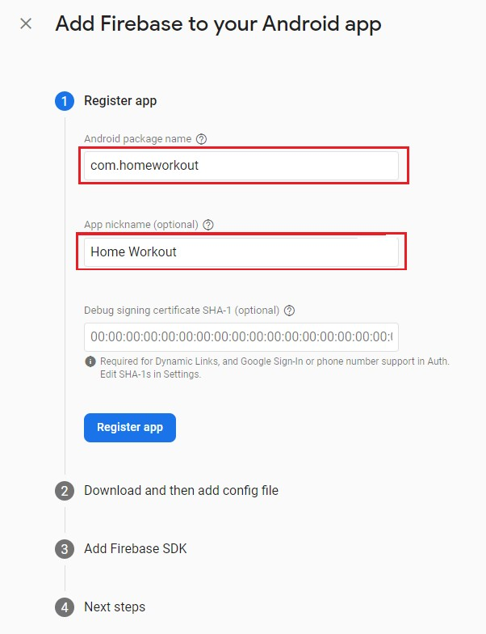
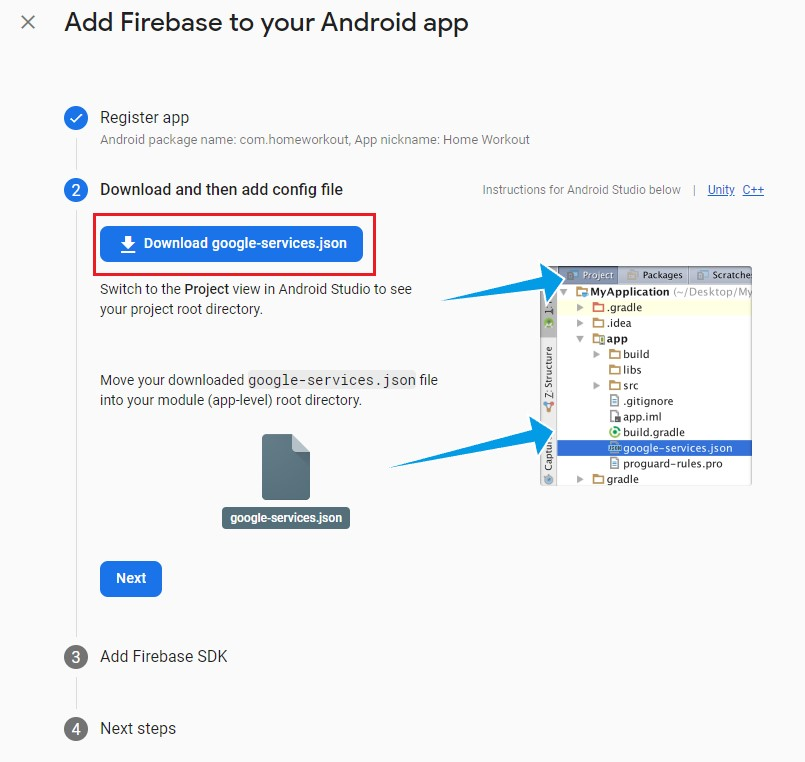
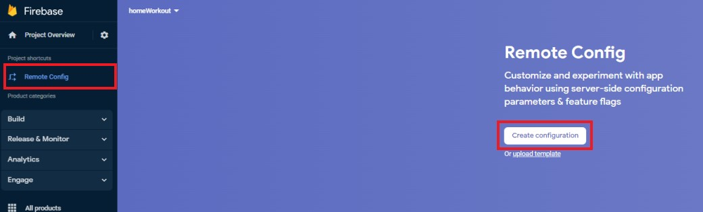
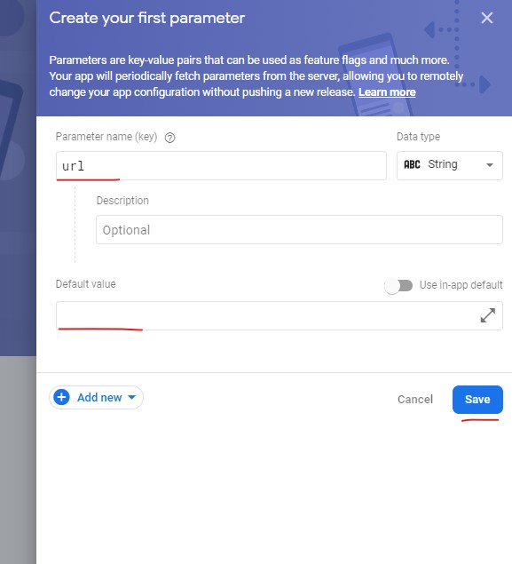

# Home Workout

Гибридное Android приложение c WebView экраном: \
Нативная часть - приложение с информацией о тренировках в домашних условиях. \
WebView окно с настроенным firebase remote config позволяющий удаленно передавать/изменять ссылку которая будет открыта вместо нативной части приложения.

---

## Технологии при разработке:

- React native cli
- React navigation
- React native WebView
- Firebase (remote config)
- AsyncStorage

---

## Развертывание:

### Клонировать репозиторий:

- открыть терминал и перейти в директорию куда будет клонирован репозиторий

- клонировать репозиторий командой `git clone https://github.com/Taashev/home-workout-mobile-app.git`

- перейти в директорию проекта и установить зависимоти командой `npm i`

### Настройка окружения:

- Для начала установить и настроить [Android Studio](https://developer.android.com/studio)

- Следующим шагом потребуется настроить окружение вот пару ресурсов которые в этом помогут

  - [официальная документация](https://reactnative.dev/docs/environment-setup)
  - [статья на habr](https://habr.com/ru/company/neoflex/blog/428912/)

    Внимание! Для успешного запуска проекта в эмуляторе потребуется версия [jdk11](https://www.oracle.com/cis/java/technologies/downloads/#java11) (именно ее указываем в перменной окружения!)

---

## Настройка Firebase remote config:

### Создаем новый проект в Firebase:

1. Зайти на сайт [Firebase](https://console.firebase.google.com/) и создать проект с именем 'homeWorkout'



### Создаем новое приложение в Firebase:

2. В созданном проект "homeWorkout" создаем новое приложение для Android.



3. Заполнить регстрационные данные. \
   (package name должен совпадать с локальным именем проекта)

```
Package name - com.homworkout
Nickname - Home Workout

```



4. Скачать файл google-services.json (нужен для подключения приложения к firebase)



5. Шаг 3 можно пропустить (эти данные уже настроены в приложении)

### Настройка соединения с Firebase:

7. Скаченый файл google-services.json добавить в проект в директорию `./android/app`.

### Настройка Firebase Remote Config:

8. На сайте Firebase в создонном проекте "homeWorkout" во вкладке "Builld" выбрать пункт "Remote Confgi"

9. Добавить (обновить) переменную "url" с нужным значением которое будет переданно в приложение или оставить поле пустым.

(по аналогии можно создавать и передовать в приложение сколько угодно перменных).




---

## Запускаем проект локально:

1. Запустить эмулятор в Android Studio
2. Открыть терминал и перейти в директорию проекта
3. Командой `npm run start` запустить сборщик "Метро"
4. Нажать латинскую клавишу `a` это сбилдит проект и запустить его на эмуляторе андройд.
   (с первого раза может не запуститься)

---

## Настройка и релиз приложения:

В официальной документации есть [инструкция](https://reactnative.dev/docs/signed-apk-android) как подготовить приложения к релизу.

1. В терменале перейти в дерикторию `./android/app`

2. Сгенерировать .keystore файл командай

   ```js
   	keytool -genkeypair -v -storetype PKCS12 -keystore my-upload-key.keystore -alias my-key-alias -keyalg RSA -keysize 2048 -validity 10000
   ```

   - строку `my-upload-key.keystore` заменить на `имя_проекта.keystore`, в нашем случае `homeworkout.keystore`
   - строку `my-key-alias` заменить на имя проекта, в нашем случае `homeworkout`

     результат:

     ```js
     	keytool -genkeypair -v -storetype PKCS12 -keystore homeworkout.keystore -alias homeworkout -keyalg RSA -keysize 2048 -validity 10000
     ```

3. Приложение готов к релизу

В терминале перейти в дерикторию `./android` и ввести команду:

- для aab релиза `./gradlew bundleRelease`
- для apk релиза `./gradlew assembleRelease`

Готовый релиз приложения находится в директории `./android/app/build/`
